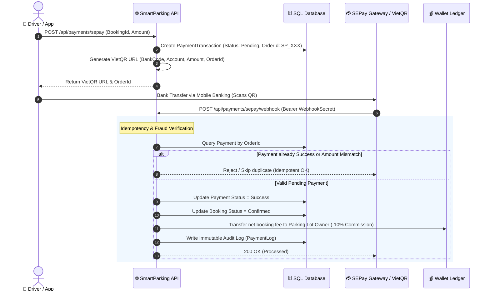

# SmartParking — Enterprise Backend (.NET 8 Clean Architecture)

[](https://dotnet.microsoft.com/)
[](https://docs.microsoft.com/en-us/dotnet/csharp/)
[](https://blog.cleancoder.com/uncle-bob/2012/08/13/the-clean-architecture.html)
[](https://www.microsoft.com/sql-server)
[](https://sepay.vn/)
[](https://cloudinary.com/)
[](https://jwt.io/)

A scalable, secure backend platform for the **Smart Parking Reservation & Space Management Ecosystem**. The platform empowers vehicle owners to locate, reserve, and pay for parking spots seamlessly while providing lot owners with real-time revenue analytics, tiered subscription workflows, and automated balance payouts.

---

## 👨‍💻 Core Authorship & Contribution

> **Author:** Le Trong Hieu ([@SnuggieBoy](https://github.com/SnuggieBoy))  
> **Role:** **Lead Backend Developer** (69 Commits — **~96% of the entire codebase**)

### Key Technical Contributions:
- **Solution Architecture:** Structured the solution using **Clean Architecture** (API, Application, Domain, Infrastructure), enforcing strict separation between business rules and data persistence.
- **FinTech Payment Processing (`SePayService.cs`):** Built end-to-end integration with the **SEPay Payment Gateway** (VietQR generation, IPN/Webhook signature validation, fraud-protection amount checks, and strict idempotency control).
- **Internal Wallet & Transactional Ledger (`WalletService.cs`):** Implemented an immutable double-entry wallet ledger supporting deposit top-ups, booking escrow, commission cuts (10%), and owner wallet payouts.
- **Early Checkout & Auto-Refund Engine:** Developed dynamic checkout fee calculations refunding prorated amounts when vehicles exit before reserved expiration times.
- **Role-Based Access Control:** Configured Google OAuth2 integration and JWT Bearer authorization handling role escalation (`Customer` -> `OwnerUpgradeRequest` -> `ParkingLotOwner`).

---

## 💳 Secure Payment & Webhook Workflow

The following sequence details how payment transactions and webhooks are processed with idempotency and fraud prevention:



---

## 🏛️ Clean Architecture Structure

```
SmartParking/
├── src/
│   ├── SmartParking.Domain/         # Core Entities (Booking, ParkingLot, Wallet, Transaction, User)
│   ├── SmartParking.Application/    # DTOs, Repository Interfaces, Services, Business Rules
│   ├── SmartParking.Infrastructure/ # EF Core DbContext, SePayService, Cloudinary, Repositories
│   └── SmartParking.API/            # RESTful Controllers, Swagger/OpenAPI, Middlewares
```

---

## ⚡ Key Engineering Highlights

### 1. Webhook Idempotency & Concurrency Guard
* **Problem:** Payment gateway webhooks frequently retry on delayed responses, risking duplicate wallet credit or double confirmation.
* **Solution:** Applied strict status checking (`PaymentStatus.Pending`) before state transitions, backed by database atomic transactions. Webhooks with already-processed order IDs return early success without re-executing balance mutations.

### 2. Prorated Auto-Refund for Early Checkout
* **Problem:** Drivers reserving parking for 4 hours but leaving after 1 hour expect a partial refund based on actual lot occupancy.
* **Solution:** Created checkout preview calculation in `BookingsController`: calculates actual duration, prorates hourly rate, refunds the delta back to the user's digital wallet, and frees the parking slot immediately for new bookings.

### 3. Clean Cloud-Ready Secret Management
* Secrets and connection strings are excluded from git.
* Supports multi-stage configuration via `appsettings.Example.json`, Azure App Configuration, and Environment Variables (`SEPAY_API_KEY`, `SEPAY_WEBHOOK_SECRET`, `JwtSettings__SecretKey`).

---

## 🚀 Setup & Local Running

### Prerequisites
- [.NET 8 SDK](https://dotnet.microsoft.com/)
- SQL Server (LocalDB or Azure SQL)

### 1. Configuration
```bash
cd Synergy_BE/SmartParking/src/SmartParking.API
cp appsettings.Example.json appsettings.Development.json
# Fill your local database connection string in appsettings.Development.json
```

### 2. Database Migration
```bash
dotnet ef database update --project ../SmartParking.Infrastructure --startup-project .
```

### 3. Run API
```bash
dotnet run
```
Access Swagger UI at `https://localhost:7001/swagger`.

---

## 📜 License
Developed as part of the **SmartParking** Startup Platform (EXE201).
